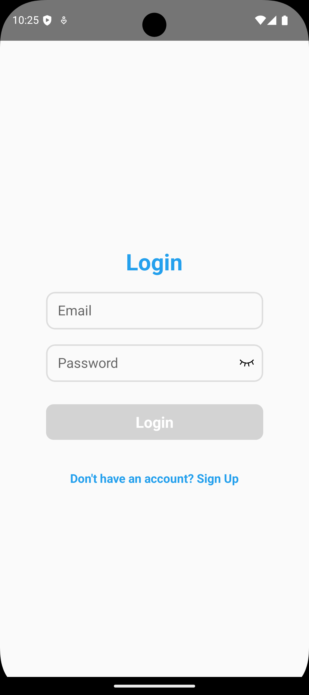
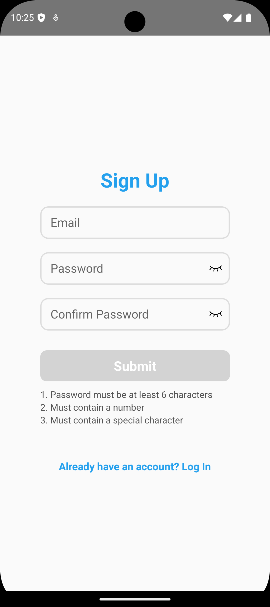
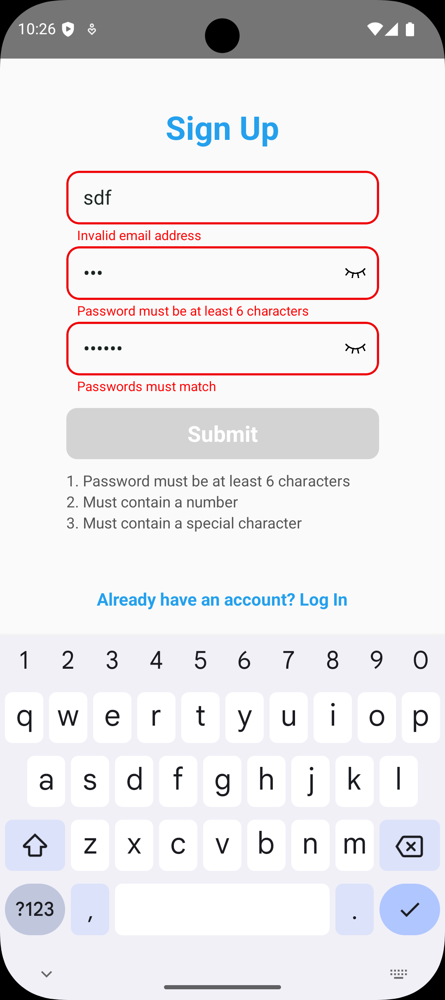

# React Native Login and Signup Application

This project is a React Native application that features a **Login** and **Signup**  functionality. The app uses `Formik` for form management, `Yup` for validation, 


[GitHub Repository](https://github.com/manojmksmanu/react-native-login-signup) *(replace with the actual link after uploading)*


---

## Features

- **Login Form:**
  - Input fields for email and password.

- **Signup Form:**
  - Input fields for email, password, and confirm password.
  - Password validation (length, numbers, special characters)

- **Validation:**
  - Real-time input validation using `Yup`.
  - Displays helpful error messages for invalid inputs.


---
##Images of assignment




## How to Run the Project

### Prerequisites

1. Install **Node.js** (version 14 or higher).
2. Install **React Native CLI** and **Expo CLI**:
   ```bash
   npm install -g expo-cli
   ```
3. Ensure you have an emulator/simulator or a physical device for testing.

### Steps to Run

1. Clone the repository:
 


2. Install dependencies:
   ```bash
   npm install
   ```

3. Start the development server:
   ```bash
   npm run start
   ```
  👌 for starting only on android npx react-native run-android

4. Run the app on a device or emulator:
   - For Android: Press `a` in the Expo terminal.
   - For iOS: Press `i` in the Expo terminal.

---

## Design Choices

### 1. **User Interface (UI)**
- Used simple and clean layouts for forms.
- Included a visually distinct button for actions (e.g., Login, Signup).
- Highlighted error messages for better user feedback.

### 2. **Functionality**
- Used `Formik` and `Yup` to separate form logic and validation from UI components.